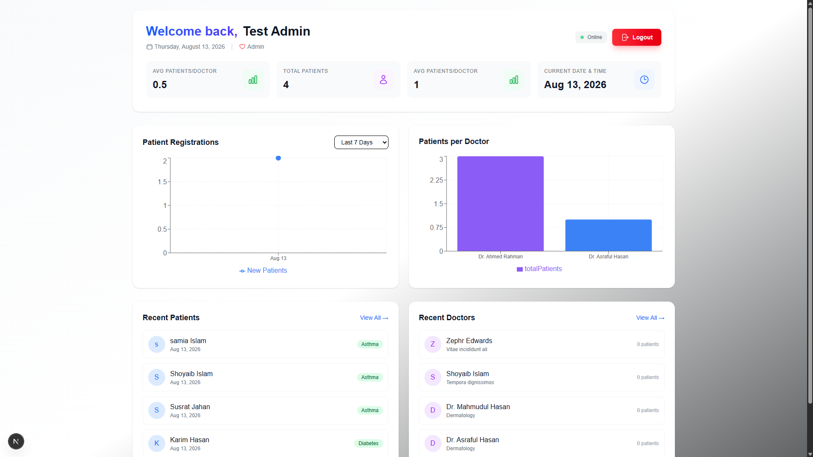
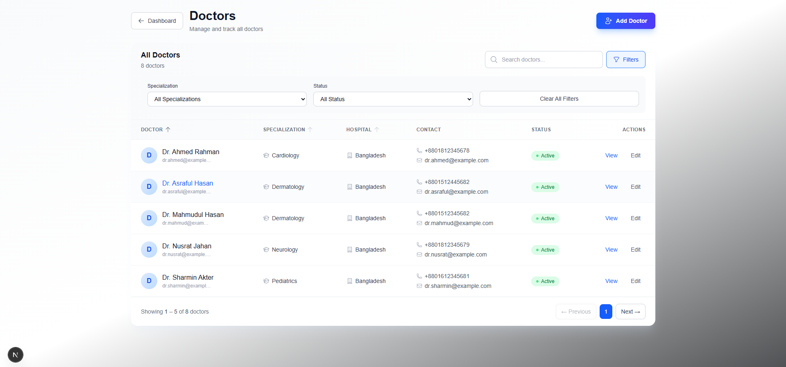
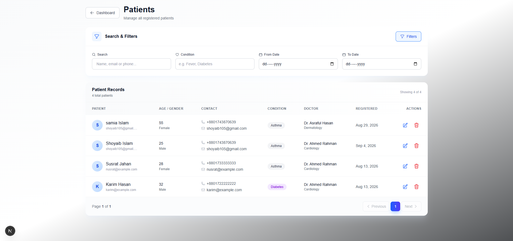
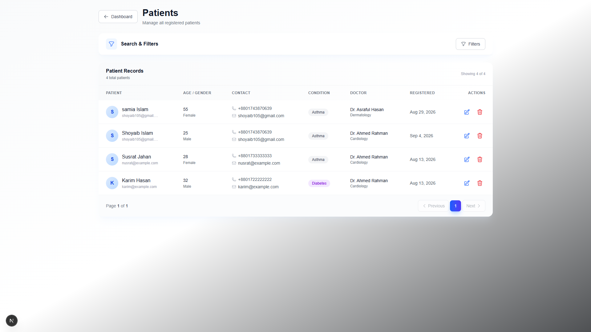

# Doctor Tracker

Doctor Tracker is a secure administrative web application for managing doctors and their associated patients. It provides authenticated access, doctor and patient management, search, filtering, pagination, and dashboard analytics with data visualization. The system uses a separate Next.js frontend and Node.js/Express backend connected to MongoDB, with a focus on clean UX, efficient database queries, reusable components, and scalable architecture.

## Features

### Authentication
- Secure admin login
- Protected application routes
- Role-based authorization
- Logout functionality

### Doctor Management
- Create doctors
- View doctor list
- Search doctors
- Filter doctors
- Pagination
- View doctor details
- Edit doctor information
- Deactivate doctors
- View patients assigned to a specific doctor
- Add new patients under a specific doctor
- Delete patients from a doctor's patient list

### Patient Management
- Dedicated patient page
- View all patients
- Search patients by name, email, or phone
- Filter by condition
- Filter by registration date
- Pagination
- Edit patient information
- Delete patients

### Dashboard & Analytics
- Total doctors
- Total patients
- Average patients per doctor
- Patients per doctor visualization
- Patient registration statistics
- Recent doctors
- Recent patients
- Date-range analytics
- Charts and graphs using Recharts

## Tech Stack

### Frontend
- Next.js 16
- React
- Tailwind CSS
- Recharts
- Heroicons

### Backend
- Node.js
- Express.js
- RESTful APIs
- JWT authentication

### Database
- MongoDB
- Mongoose

### Setup Guide

1. Clone the repository:
```bash
git clone YOUR_GITHUB_REPOSITORY_URL
cd doctor-tracker
```

2. Backend:
```bash
cd backend
npm install
npm run dev
```

Create `backend/.env` from `.env.example`:
```env
PORT=5000
MONGODB_URI=your_mongodb_connection_string
JWT_SECRET=your_jwt_secret
CLIENT_URL=http://localhost:3000
```

3. Frontend (in another terminal):
```bash
cd frontend
npm install
npm run dev
```

Create `frontend/.env.local`:
```env
NEXT_PUBLIC_API_URL=http://localhost:5000/api
```

Frontend: `http://localhost:3000`

## Environment Variables

### Backend `.env.example`
```env
PORT=5000
MONGODB_URI=
JWT_SECRET=
CLIENT_URL=http://localhost:3000
```

### Frontend `.env.local`
```env
NEXT_PUBLIC_API_URL=http://localhost:5000/api
```

Never commit real credentials or secret keys.

## System Architecture

```text
Next.js Frontend
      |
      | REST API / HTTP
      v
Node.js + Express Backend
      |
      | Mongoose
      v
MongoDB
```

### Data Flow

1. User interacts with the Next.js frontend.
2. Frontend sends REST API requests to Express.
3. Authentication middleware protects authorized endpoints.
4. Controllers handle validation and business logic.
5. Mongoose communicates with MongoDB.
6. Backend returns JSON responses.
7. Frontend updates the UI.

## Technical Decisions

### 1. Separate Frontend and Backend

Next.js handles UI, routing, and data presentation while Node.js/Express handles REST APIs, authentication, validation, and database operations. This separation keeps responsibilities clear and allows the API to be reused by other clients.

### 2. MongoDB Indexing and Pagination

Indexes are used on frequently queried patient fields, doctor relationships, conditions, and registration dates. Pagination uses `countDocuments()`, `skip()`, and `limit()` so the frontend receives only the required records and pagination metadata.

## API Overview

### Authentication
```text
POST /api/auth/login
GET  /api/auth/me
POST /api/auth/logout
```

### Doctors
```text
POST   /api/doctors
GET    /api/doctors
GET    /api/doctors/:id
PUT    /api/doctors/:id
DELETE /api/doctors/:id
```

### Patients
```text
POST   /api/doctors/:doctorId/patients
GET    /api/patients
GET    /api/doctors/:doctorId/patients
PUT    /api/patients/:id
DELETE /api/patients/:id
```
## Visual Evidence

### Dashboard - Desktop



### Doctors - Desktop




[Doctors Desktop](./public/Mobile%20Dashbord.png)
[Doctors Desktop](./public/mobile%20dashbord2.png)
```

## Project Structure

``text
doctor-tracker/
├── frontend/
│   └── src/
│       ├── app/
│       ├── components/
│       ├── context/
│       └── lib/
└── backend/
    ├── controllers/
    ├── models/
    ├── routes/
    ├── middleware/
    └── src/
```

## Performance & Optimization

- MongoDB indexes for frequently queried fields
- Database-level search and filtering
- Pagination for large datasets
- Reusable frontend components
- Protected API routes
- API validation and error handling
- Reduced unnecessary data transfer

## Future Improvements

- Automated testing
- Advanced role permissions
- More granular analytics
- Advanced filtering
- Production deployment

## License

This project was developed as part of a technical project assignment
